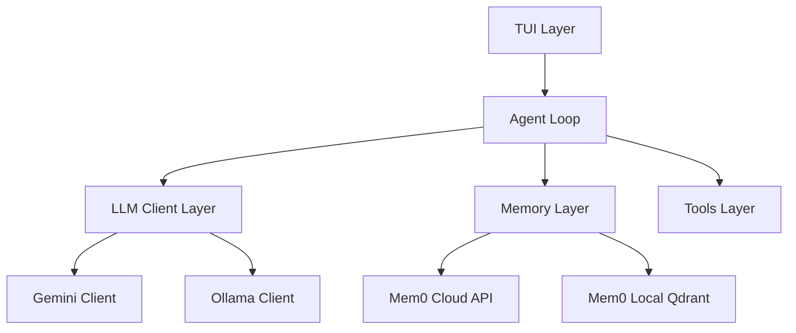
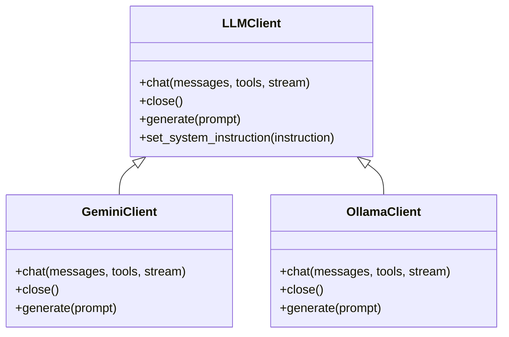
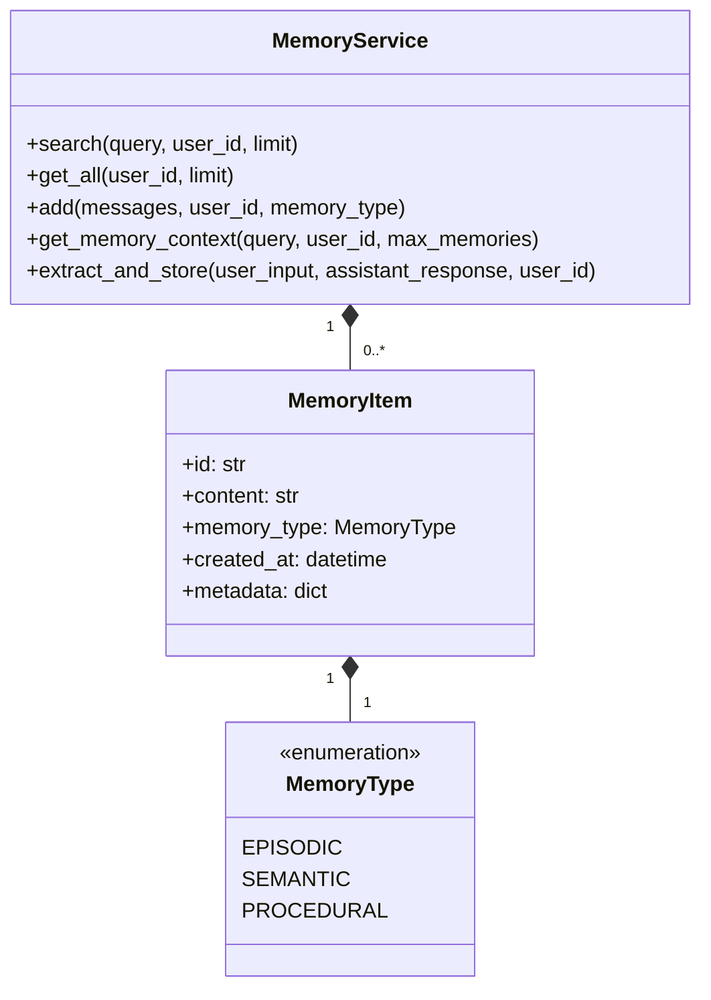
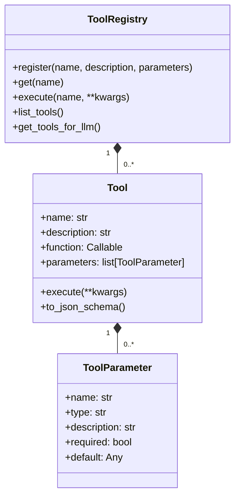
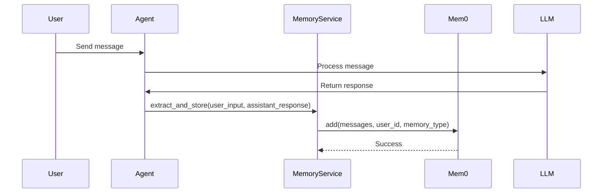
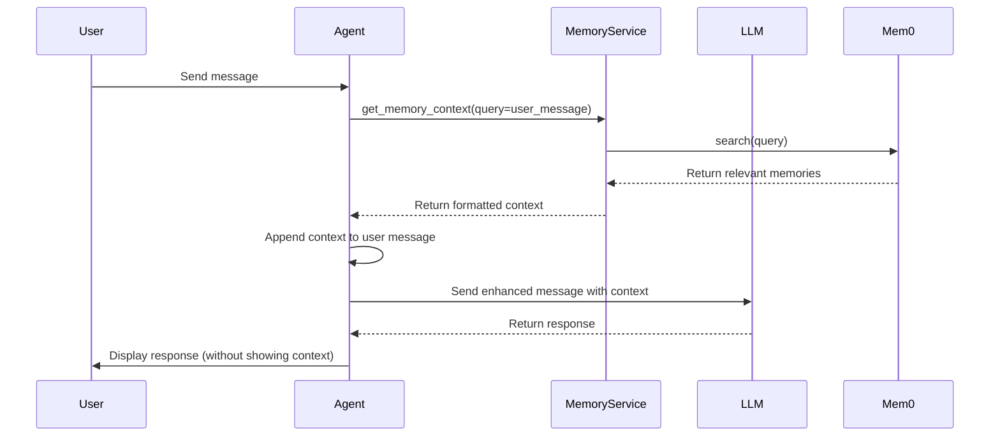
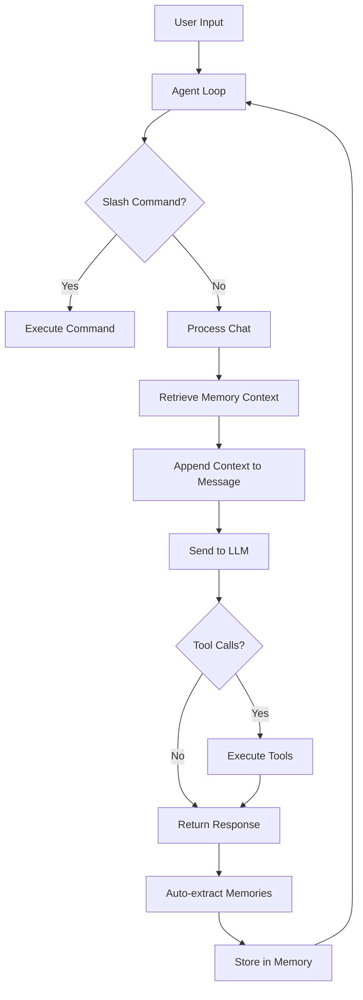

# Terent Architecture Explanation

## Overview

Terent is a sophisticated TUI-based AI Agent that replicates the "Claude Code" interface, powered by Google Gemini and Ollama, with advanced long-term memory capabilities. The architecture is designed to be modular, extensible, and efficient.

## Architecture Layers

The system is organized into several distinct layers:

1. **TUI Layer**: User interface using Rich library
2. **Agent Loop**: Core conversation and tool management
3. **LLM Client Layer**: Abstraction for different LLM providers
4. **Memory Layer**: Persistent memory using Mem0
5. **Tools Layer**: File operations, web search, and OSINT tools

## Key Components

### 1. TUI Layer (`tui.py`)

The Text User Interface layer provides a beautiful, dark-mode interface with Tangerine Orange accents. It handles:

- User input/output
- Message rendering with syntax highlighting
- Status indicators and activity tracking
- Slash command interface

### 2. Agent Loop (`main.py`)

The core of the system, the `AgentLoop` class manages:

- **Memory Management**: Sliding window approach for conversation context
- **Slash Commands**: `/init`, `/config`, `/model`, `/clear`, `/help`, `/memory`, `/forget`, `/remember`
- **Tool Execution**: File operations, web search, OSINT tools
- **LLM Interaction**: Sending messages, receiving responses, handling tool calls
- **Context Injection**: Adding memory context to LLM prompts

### 3. LLM Client Layer (`llm_client.py`)

This layer provides an abstraction over different LLM providers:

- **GeminiClient**: Google Gemini API integration
- **OllamaClient**: Local Ollama model integration
- **Standardized Interface**: Common methods for chat, streaming, and tool usage
- **Message Conversion**: Converts between internal format and provider-specific formats

### 4. Memory Layer (`mem_0.py`)

The persistent memory layer uses Mem0 for long-term recall:

- **MemoryService**: Main interface for memory operations
- **Memory Types**: Episodic (events), Semantic (facts), Procedural (how-to)
- **Search**: Semantic search for relevant memories
- **Context Building**: Formats memories for LLM injection
- **Auto-extraction**: Automatically extracts and stores memories from conversations

### 5. Tools Layer (`tools.py`)

The tools layer provides various utilities:

- **File Operations**: `ls`, `read_file`, `write_file`, `append_file`, `delete_file`
- **System Commands**: `run_command`
- **Web Search**: `web_search`
- **Project Tools**: `get_project_structure`
- **OSINT Tools**: `dns_lookup`, `whois_lookup`, `port_scan`, `http_headers`

## Memory Context Extraction

The memory system extracts context in several ways:

1. **Auto-extraction**: After each conversation exchange, the system automatically extracts and stores memories
2. **Manual Addition**: Users can manually add memories using the `/remember` command
3. **Memory Types**: Memories are categorized as:
   - **Episodic**: Specific past events/conversations
   - **Semantic**: User preferences and facts
   - **Procedural**: How-to knowledge and patterns

The extraction process:

1. User sends a message
2. Agent processes the message
3. After receiving the assistant's response
4. The system calls `extract_and_store()` with both user input and assistant response
5. Mem0 handles the actual extraction and storage

## Context Injection to LLM

Context is injected into the LLM in a carefully controlled manner:

1. **Memory Context Retrieval**: Before sending a message to the LLM, the agent retrieves relevant memories
2. **Context Formatting**: Memories are formatted with icons and organized by type
3. **Context Injection**: The context is appended to the user's message in a special `[MEMORY CONTEXT]` section
4. **Token Management**: The system tracks token usage to avoid exceeding limits

The injection process:

1. User sends a message
2. Agent retrieves memory context using `get_memory_context()`
3. Agent creates a modified copy of the messages with memory context appended
4. Agent sends the enhanced messages to the LLM
5. LLM receives the context but it's hidden from the user in the TUI

## Data Flow

## Configuration Management

The system uses a comprehensive configuration system (`config.py`):

- **Environment Variables**: Loaded from `.env` file
- **Model Configuration**: Gemini and Ollama models
- **Memory Settings**: Mem0 API keys and local configuration
- **Theme Settings**: TUI colors and styling
- **Safety Settings**: Gemini safety thresholds

## Key Features

1. **Hybrid Brain**: Supports both cloud (Gemini) and local (Ollama) models
2. **Persistent Memory**: Long-term recall using Mem0
3. **Tool Integration**: File operations, web search, and OSINT tools
4. **Slash Commands**: Quick access to common operations
5. **Markdown Support**: Syntax-highlighted code and rich formatting
6. **Streaming**: Real-time response streaming
7. **Token Management**: Sliding window for efficient context management

## Error Handling and Logging

The system includes comprehensive error handling and logging:

- **Logging**: Structured logging with different levels
- **Error Recovery**: Graceful handling of API failures
- **Validation**: Configuration validation on startup
- **Reasoning Traces**: Detailed logs of agent reasoning process

## Future Enhancements

The architecture is designed to be extensible for future enhancements:

- Additional LLM providers
- More sophisticated memory extraction
- Enhanced tool capabilities
- Improved TUI features
- Better performance optimization

## Conclusion

Terent's architecture is a well-designed, modular system that effectively combines the power of large language models with persistent memory and a comprehensive toolset. The layered approach allows for easy maintenance, extension, and optimization while providing a rich user experience through the TUI interface.